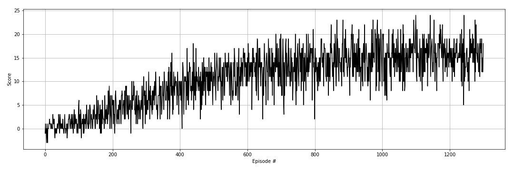
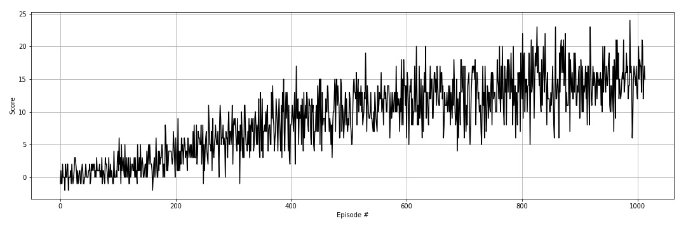

# Summary
The project involved training an agent to navigate in a 3D environment - collecting specific items while avoiding others. The objective was to use value-based and model-free reinforcement learning models and more specifically Deep Q-learning.

I have successfully implemented Deep Q-learning and have reached the project goal. As a second step I have implemented Double Deep Q-learning to achieve improved performance. The advantage of DDQN over DQN is the implementation of two separate networks in choosing and evaluating the action. in this way, the model mitigates the overestimation of the value function.

|Random agent|Trained DDQN agent|
|------------|-------------|
|||

# Hyperparameters

| Hyperparameter                      | Value |
| ----------------------------------- | ----- |
| Replay buffer size                  | 1e5   |
| Batch size                          | 64    |
| $\gamma$ (discount factor)          | 0.99  |
| $\tau$                              | 1e-3  |
| Learning rate                       | 5e-4  |
| update interval                     | 4     |
| Number of episodes                  | 5000  |
| Max number of timesteps per episode | 1000  |
| Epsilon start                       | 1.0   |
| Epsilon minimum                     | 0.01  |
| Epsilon decay                       | 0.997 |

# Results

## DQN
Trained in 1200 episodes and an average training score of 15.34. Average score of playing with the trained agent is 13.05.

## DDQN
Trained in 914 episodes and an average training score of 15.04. Average score of playing with the trained agent is 14.60.

## Takeaway
The agent trained with Double DQN took less time to reach the target score and with lower variance in the training average scores across the episodes.

Also the trained DDQN agent performed better on average when playing.
