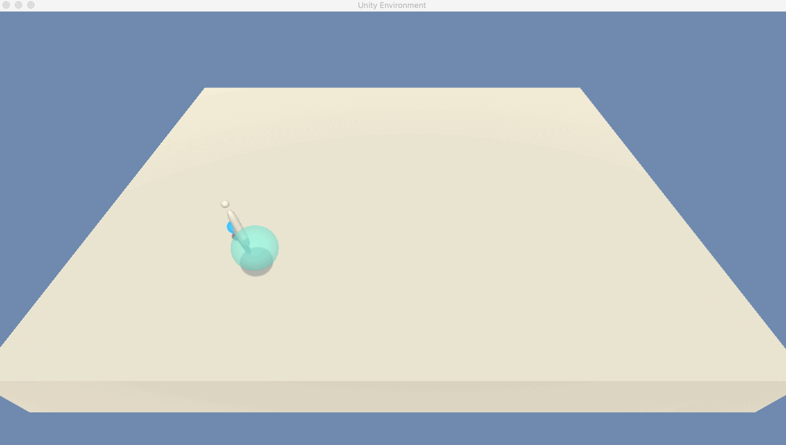
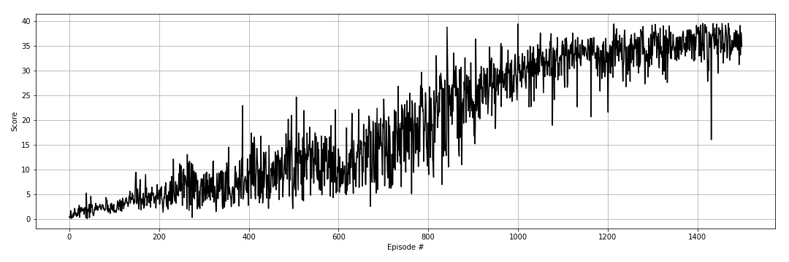

# Summary
The project involved training an agent to move double-jointed arm towards a target in a 3D environment. The action space this time is continuous which makes it increasingly more complex thant the first proejct. The objective is to use suitable actor-critic methods covered in the course.

I have successfully implemented DDPG (Deep Deterministic Policy Gradient) and have reached the project goal. For the purpose, I have used the single agent enviroment provided in the project instructions.

|Random agent|Trained DDPG agent|
|------------|-------------|
|||

# The Environment
* Goal: Moving a double-jointed arm to reach and keep within a target location.
* Reward: +0.1 for each timestep when the arm is within the target location.
* Observation space: low-dimensional observation with 33 variables corresponding to position, rotation, velocity, and angular velocities of the arm.
* Action space: Each action is a vector with four numbers, corresponding to torque applicable to two joints. Every entry in the action vector should be a number between -1 and 1.

# Model Architecture
The objective of the project is to learn a continous action space, which makes the task more challenging than the previous project on navigation. The value-based methods I have used are not suitable in this case. Instead, policy-based methods covered in this part of the course can be used for solving the challenge.

The advantages of policy-based methods include:
* Continuous action space
* Simplicity - these methods learn by mapping directly from the state to the optimal policies instead of maintaining a separate value function estimate
* Stochastic policies - these methods are suited to learn both deterministic and stochastic policies

An improvement over these methods is the introduction of actor-critic methods which leverage the strenghts of both previous methods - value-based and policy-based. Using policy-based method the 'actor' learn to react to the enviroment by directly estimating a optimal policy with gradient ascend. At the same time the 'critic' estimates the value of the state-action pairs. In this way a more accelerated and stable training can be achieved.

In this project, I have implemented Deep Deterministic Policy Gradient ([original paper](https://arxiv.org/pdf/1509.02971.pdf)). DDPG can be regarded as an extension to Deep Q-learning to solving tasks with continous action space.

I have used a DDPG implementation from the Pendulum gym environment in the course repo. I have used almost almost the same hyperparameters as described in the paper except for the batch size (128 vs origina 64) and no weight decay.

As an addition I have added batch normalisation to the network. Before implemting it the traiing wasn' performing well. The problem could have been the computations on large input values and model parameters. Batch normalisation addresses the problem by scaling the features to be within same range by normalising with unit mean and variance.

Implementation of the model is done in `PyTorch`.

# Hyperparameters

| Hyperparameter                      | Value |
| ----------------------------------- | ----- |
| Replay buffer size                  | 1e6   |
| Batch size                          | 128   |
| $\gamma$ (discount factor)          | 0.99  |
| $\tau$                              | 1e-3  |
| Actor learning rate                 | 1e-4  |
| Critic learning rate                | 1e-3  |
| Weight decay                        | 0     |
| Number of episodes                  | 1500  |
| Max number of timesteps per episode | 1000  |

# Results

## DDPG
The agent is trained in 1500 episodes and an average training score of 35.78. Average score of playing with the trained agent is 32.08 over 100 episodes.

## Ideas for future work
- Trying out the environment with the 20 agents
- Implementing other RL algorithms - D4PG (Distributed Distributional Deterministic Policy Gradient), TRPO (Trust Region Policy optimisations), PPO (Proximal Policy Optimisation),
- Add prioritised experience replay - the rational behind is that there are some experiences that are more important than others. Sampling uniformally and with limited buffer capacity can lead to lower chances of getting these experiences and loosing older important experiences. This can be overcome by assinging priority values to each experience tuple.
