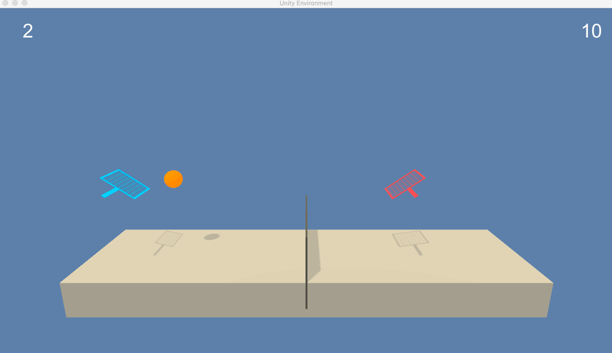
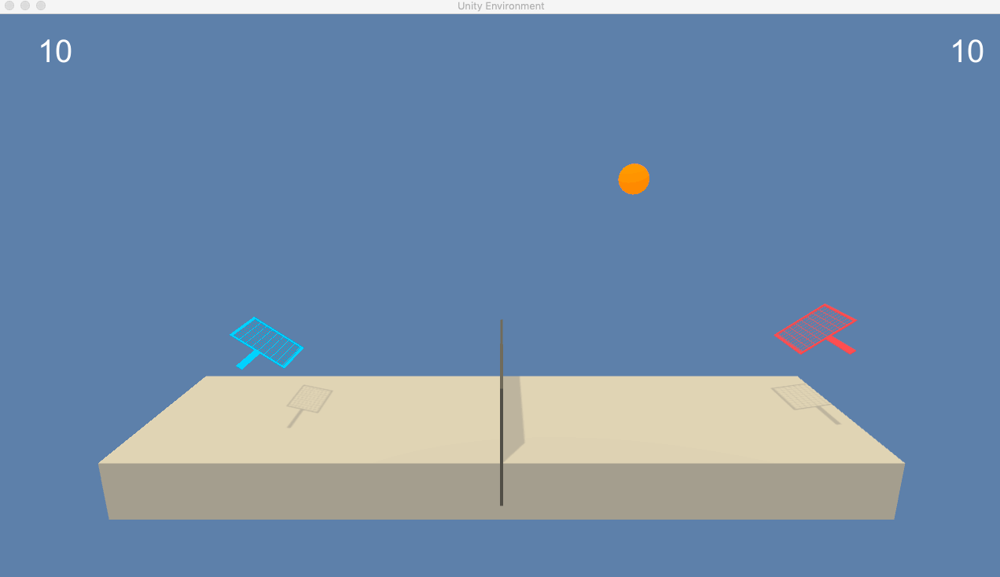
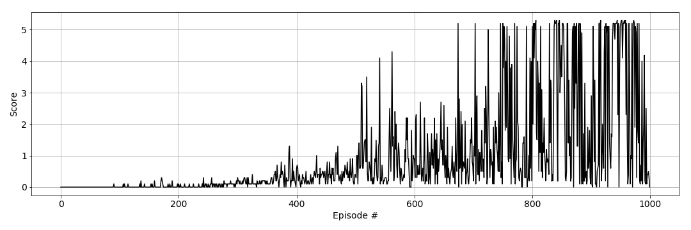

# Summary
The project involved training agents to control rackets in 3d space. The goal for each agent is to bounce a ball over a net and keep the ball playing. Each agentts receives a reward of 0.1 of hitting the ball over the net. In case the ball hits the ground or reaches outside of the bounds, the agent who controls the space or hit the ball respectively receives a reward (penalty) of -0.1.

I have successfully implemented extended DDPG (Deep Deterministic Policy Gradient) to multi-agent environment and have reached the project goal.

|Random agents|Trained DDPG agents|
|------------|-------------|
|||

# The Environment
* Goal: Hitting a ball over a net with a racket.
* Reward: +0.1 for each time the ball goes over the net and -0.1 each time the ball hits the ground or goes otuside of bounds.
* Observation space: low-dimensional observation with 8 variables ccorresponding to the position and velocity of the ball and racket. Each agent receives its own, local observation.
* Action space: Two continuous actions are available, corresponding to movement toward (or away from) the net, and jumping.

# Model Architecture
The objective of the project is to learn a continous action space for multi-agent environment, which makes the task increasingly more challenging than the previous two projects on navigation and continuous control.

To complete the objective of the project, I have tried to extend the implementation Deep Deterministic Policy Gradient ([paper](https://arxiv.org/pdf/1509.02971.pdf)) to multi-agent envirnoment MADDPG ([paper](https://papers.nips.cc/paper/7217-multi-agent-actor-critic-for-mixed-cooperative-competitive-environments.pdf)).

I have extended the framework to shared replay buffer for both agents - so they share and learn from combined experiences. I have used separate actor-critic networks for each agent.

It took me several iterations over the hyperparameters until the agents reached suffessfull learning, although not very stable. 

As an addition I have added batch normalisation to the network. Before implemting it the traiing wasn' performing well. The problem could have been the computations on large input values and model parameters. Batch normalisation addresses the problem by scaling the features to be within same range by normalising with unit mean and variance.

Implementation of the model is done in `PyTorch`.

# Hyperparameters

| Hyperparameter                      | Value |
| ----------------------------------- | ----- |
| Replay buffer size                  | 1e6   |
| Batch size                          | 256   |
| $\gamma$ (discount factor)          | 0.99  |
| $\tau$                              | 1e-2  |
| Actor learning rate                 | 1e-3  |
| Critic learning rate                | 1e-3  |
| Weight decay                        | 0     |
| Number of episodes                  | 1000  |

# Results

## DDPG
The agents are trained in 1000 episodes and an average training score of 2.71. Average score of playing with the trained agents is 0.68 over 100 episodes.

## Ideas for future work
- Add a centralised critic model instead of the current decenralised (separate) for each agent
- Exlore other RL algorithms to find more stable, efficient learning - e.g. PPO (Proximal Policy Optimisation)
- Add prioritised experience replay - the rational behind is that there are some experiences that are more important than others. Sampling uniformally and with limited buffer capacity can lead to lower chances of getting these experiences and loosing older important experiences. This can be overcome by assinging priority values to each experience tuple.
